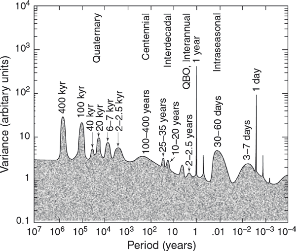
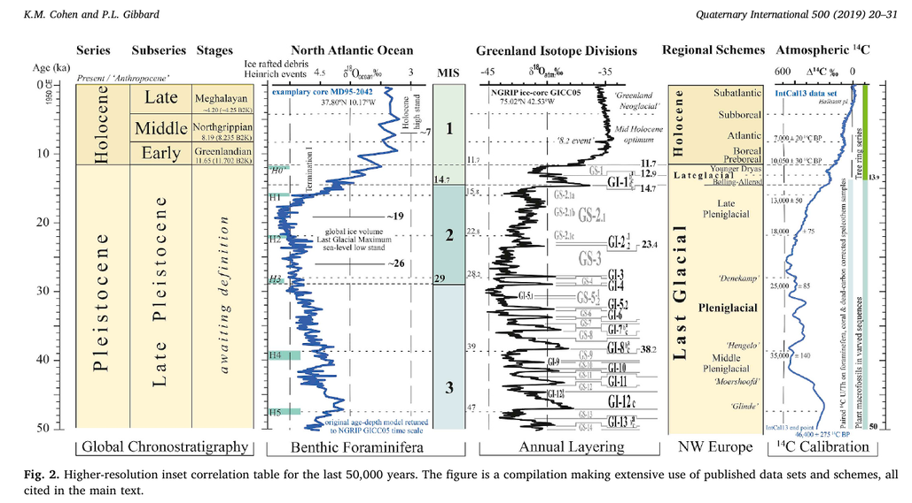
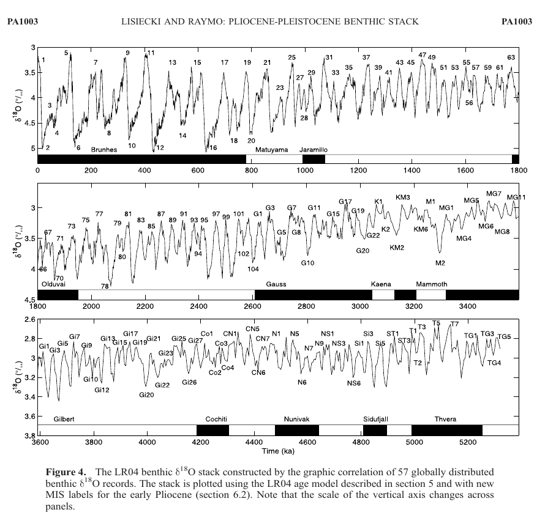

# Climate change in the geological past - Notes

## Climate

Main sources:
- Ruddiman, Earth's climate past and future.

**Earth  system** science as inter- and multidisciplinary approach to climate science.

### Components of climate system
1. **O**cean
2. **L**and surface
3. **I**ce
4. **V**egetation
5. **A**tmosphere

Revolutions of knowledge in Earth's sciences:

1. Evolution: 19th century
2. Plate tectonics: 1960-1970
3. **Climate change**: now (claimed)

### Climate **forcing**
Causes that drive climate change:

1. Tectonic processes (~Ma)
2. Orbital changes (~100 ka) --> **Milankovitch orbital cycles**: resulting wave after modulation of the cycles below
	1. changes in eccentricity $ 0 < \epsilon < 0.06$, two oscillations:
		- 413 ka
		- 100 ka
	2. changes in obliquity (axial tilt) 22.1°-24.5° (today 23.5°), enhances or weakens seasonal variations:
		- 41 ka
	3. precession of the axis: gives rise to **precession of the equinoxes** combined with the precession of the ellipse
		- stronger cycle at 23 ka
		- weaker cycle at 19 ka
3. Solar strength changes (slowly increases, but cycles exist)
4. Antropogenic forcing

Source: [Quante, M.. (2010). The Changing Climate: Past, Present, Future. 10.1007/978-3-540-92160-8_2.](https://www.researchgate.net/publication/226931555_The_Changing_Climate_Past_Present_Future)

### Milankovitch theory
Ice builds up in the northern emisphere when insolation is small which happens if:

1. Axis tilt is small
2. Summer is at the aphelion

### Climate **response**
Effects of climate forcing

### Climate variability modes
1. Forced mode: response to external forcing
2. Free mode due to internal variabilities and feedbacks

## Proxies for paloclimate

Proxies should be **continuous**

1. Geomorphology
2. Stratigraphy: source-to-sink system (erosion --> transfer --> deposition)
	1. Lake deposits
		- wave-cut terraces
		- varves: stratigraphic couplets of clay (winter) - sand (summer) deposits 
	2. Deep marine environment
3. Paleontology: isotope composition ratio in pelagic foraminiferal deposits reflects past temperature of marine water (Cesare Emiliani, founder of paleoceanography)
	lighter isotopes (e.g. $^{16}O$) evaporate more than heavier ones (e.g. $^{18}O$) --> rain (and ice) contains more light isotopes --> during global cooling ice builds up leaving the ocean with higher heavier isotope concentration and storing lighter isotopes on land
	per mil difference: $\delta^{18}O = \biggl( \frac{ \bigl( \frac{^{18}O}{^{16}O}\bigr) \_{sample}} {\bigl( \frac{^{18}O}{^{16}O} \bigr)\_{standard}} -1 \biggr) ‰ $
	1. $\delta^{18}O > 0$ lower temperatures, glacial period
	2. $\delta^{18}O < 0$ higher temperatures, interglacial period (higher sea level)
4. Speleothems, in particular stalagmites:
	1. discontinuity in growth: drought
	2. Mg, Ca, Sr proportion: aridity
5. Pollen (from lake or deep sea deposits): 
	1. arboreal/non-arboreal ratio: warm/cool phase
	2. pine/oak ratio: cool/warm phase
6. Diatoms (paleolimnology): information on moisture level
7. Tree rings
	1. earlywood/latewood couplet to count years
	2. information on precipitation, drought, forest fires, pests
	
Discontinuous proxies: moraine (glacial debris).

## Dating techniques
1. $^{14}C$: for the last 40 ka
2. OSL (Optically Stimulated Luminescence): 0-300 ka BP
3. ESR (Electron Spin Resonance): several 100 ka BP
4. uranium-thorium (U-Th): [up to 500 ka BP](https://isobarscience.com/u-th/application/)

## Period, epochs and chronozones
Quaternary: 2.58My:

1. Paleocene (early, middle, late: last interglacial): 2.58 Ma-11650 a BP
2.  Holocene: current geological epoch, 11650 a BP
	- Preboreal (10 ka–9 ka BP)
	- Boreal (9 ka–8 ka BP),
	- Atlantic (8 ka–5 ka BP),
	- Subboreal (5 ka–2.5 ka BP) and
	- Subatlantic (2.5 ka BP–present).
	

### Marine isotope stages timescale
A timescale derived from benthic isotopic sequences.

1. stages:
	- even numbers: glacial peaks
	- odd numbers: interglacial troughs
2. sub-stages:
	- stadials
	- interstadials
	

## Last interglacial (129-116 ka)

Proxies:

1. Coral reef:
2. Marine terraces: formed by erosion resistant corals
3. Tidal notches
4. Shell deposits

Main dating technique: uranium-thorium (U-Th) dating --> confirms $\delta^{18}O$ data

Dansgaard-Oeschger (D-O) cycles: sub-Milankovitch

## Monsoons

Monsoons are weather systems driven by seasonal changes in solar radiation.
Land heats up and cools down at higher rate than the ocean, resulting in temperature and pressure gradients.

There are three strong monsoons on Earth:

1. Asian monsoon (India, south east Asia)
2. North African monsoon
3. South American monsoon

There are two phases of the monsoon:

1. summer monsoon: wet
2. winter monsoon: dry

An higher insolation due to orbital changes (precession 23 ka cycle in particular)increases the strength of the summer monsoon: land heats up more --> atmosphere upwards motion is greater --> more inflow of moist ocean air --> more rainfall on land.

### Proxies of stronger monsoons in the past

North African monsoon:

1. Dust deposition: lower concentration on the Mediterranean basin (more moist soil gives away less dust to the wind).
2. Diatoms: windblown from wet Sahara lakes to the Atlantic when they are empty.
3. Sapropel: black muddy deposits on the Mediterranean basin when Nile disharge is higher: stronger monsoon --> low-salinity lid --> decreased deep waters circulation --> depleted oxygen concentration (anoxic water) --> sea life die-off

Asian monsoon:

1. Caves: $\delta^{18}O$ changes in stalagmites
2. Methane in ice: most methane is generated in wet tropical environments (bogs)

## Glossary

- Benthic Foraminifera: "Benthic foraminifera are protozoa, which evolved during the Cambrian and inhabited all possible marine environments from shallow water intertidal regions to deep trenches."  Source: [R. Saraswat, R. Nigam, in Encyclopedia of Quaternary Science (Second Edition), 2013](https://www.sciencedirect.com/science/article/pii/B978044453643300279X)
- Diatoms: unicellular algae sensitive to water salinity
- Response time: time taken to fully respond to a change
