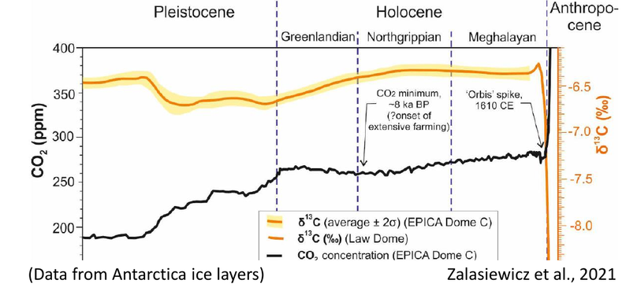

# Climate change in the geological past - Notes

## Climate

Main sources:
- Ruddiman, Earth's climate past and future.

**Earth  system** science as inter- and multidisciplinary approach to climate science.

### Components of climate system
1. **O**cean
2. **L**and surface
3. **I**ce
4. **V**egetation
5. **A**tmosphere

Revolutions of knowledge in Earth's sciences:

1. Evolution: 19th century
2. Plate tectonics: 1960-1970
3. **Climate change**: now (claimed)

### Climate **forcing**
Causes that drive climate change:

1. Tectonic processes (~Ma)
2. Orbital changes (~100 ka) --> **Milankovitch orbital cycles**: resulting wave after modulation of the cycles below
	1. changes in eccentricity $ 0 < \epsilon < 0.06$, two oscillations:
		- 413 ka
		- 100 ka
	2. changes in obliquity (axial tilt) 22.1°-24.5° (today 23.5°), enhances or weakens seasonal variations:
		- 41 ka
	3. precession of the axis: gives rise to **precession of the equinoxes** combined with the precession of the ellipse
		- stronger cycle at 23 ka
		- weaker cycle at 19 ka
3. Solar strength changes (slowly increases, but cycles exist)
4. Antropogenic forcing

Source: [Quante, M.. (2010). The Changing Climate: Past, Present, Future. 10.1007/978-3-540-92160-8_2.](https://www.researchgate.net/publication/226931555_The_Changing_Climate_Past_Present_Future)

### Milankovitch theory
Ice builds up in the northern emisphere when insolation is small which happens if:

1. Axis tilt is small
2. Summer is at the aphelion

### Climate **response**
Effects of climate forcing

### Climate variability modes
1. Forced mode: response to external forcing
2. Free mode due to internal variabilities and feedbacks

## Proxies for paloclimate

Proxies should be **continuous**

1. Geomorphology
2. Stratigraphy: source-to-sink system (erosion --> transfer --> deposition)
	1. Lake deposits
		- wave-cut terraces
		- varves: stratigraphic couplets of clay (winter) - sand (summer) deposits 
	2. Deep marine environment
3. Paleontology: isotope composition ratio in pelagic foraminiferal deposits reflects past temperature of marine water (Cesare Emiliani, founder of paleoceanography)
	lighter isotopes (e.g. $^{16}O$) evaporate more than heavier ones (e.g. $^{18}O$) --> rain (and ice) contains more light isotopes --> during global cooling ice builds up leaving the ocean with higher heavier isotope concentration and storing lighter isotopes on land
	per mil difference: $\delta^{18}O = \biggl( \frac{ \bigl( \frac{^{18}O}{^{16}O}\bigr) \_{sample}} {\bigl( \frac{^{18}O}{^{16}O} \bigr)\_{standard}} -1 \biggr) ‰ $
	1. $\delta^{18}O > 0$ lower temperatures, glacial period
	2. $\delta^{18}O < 0$ higher temperatures, interglacial period (higher sea level)
4. Speleothems, in particular stalagmites:
	1. discontinuity in growth: drought
	2. Mg, Ca, Sr proportion: aridity
5. Pollen (from lake or deep sea deposits): 
	1. arboreal/non-arboreal ratio: warm/cool phase
	2. pine/oak ratio: cool/warm phase
6. Diatoms (paleolimnology): information on moisture level
7. Tree rings
	1. earlywood/latewood couplet to count years
	2. information on precipitation, drought, forest fires, pests
	
Discontinuous proxies: moraine (glacial debris).

## Dating techniques

1. $^{14}C$: for the last 40 ka
2. OSL (Optically Stimulated Luminescence): 0-300 ka BP
3. ESR (Electron Spin Resonance): several 100 ka BP
4. uranium-thorium (U-Th): [up to 500 ka BP](https://isobarscience.com/u-th/application/)

## Period, epochs and chronozones

Quaternary: 2.58My:

1. Paleocene (early, middle, late: last interglacial): 2.58 Ma-11650 a BP
2.  Holocene: current geological epoch, 11650 a BP
	- Preboreal (10 ka–9 ka BP)
	- Boreal (9 ka–8 ka BP),
	- Atlantic (8 ka–5 ka BP),
	- Subboreal (5 ka–2.5 ka BP) and
	- Subatlantic (2.5 ka BP–present).
	

### Marine isotope stages (MIS) timescale

A timescale derived from benthic isotopic sequences.

1. stages:
	- even numbers: glacial peaks
	- odd numbers: interglacial troughs
2. sub-stages:
	- stadials
	- interstadials

## Last interglacial (129 - 116 ka)

MIS5e
Proxies:

1. Coral reef:
2. Marine terraces: formed by erosion resistant corals
3. Tidal notches
4. Shell deposits
5. Deposit in the Po Plain
6. Pollen records (vegetation response to climate change is a bit delayed)--> short cool period at 121 ka

Main dating technique: uranium-thorium (U-Th) dating --> confirms $\delta^{18}O$ data

## Last glacial (115 - 11.6 ka)

MIS2, MIS3, MIS4, MIS5[a-d]

### Dansgaard-Oeschger (D-O) cycles

Sub-Milankovitch cycles of abrupt warming (decades) follwed by slower cooling (centuries/millennia) in the last glacial.

13 D-O cycles between 45-11.6 ka
Average period: 1470 years

Proxies:

1. Greenland ice cores --> $\delta^{18}O$
2. Pollen (herbs/trees --> cold/warm)
3. Soils (rich/poor in clay and carbon --> cold/warm)
4. Stalagmites
5. Marine/fluvial terraces --> confirm stepped sea level fall and cooling
6. Ice-rafted debris (IRD) recorded in sea floor deposits --> ice rafts --> Heinrich cycles (abrupt warming)
	- minor events: volcanic rocks and sandstone (1500 year period)
	- major events: limestone and other rocks (multiples of 1500 year period)
	
7. Plankton assemblages during LGM --> little cooling at the tropics
8. Glacial loess <-- deposited downwind of large ice sheets  <-- silt transported (and generated) by rivers <-- large erosion by ice generates silt 
	- Loess --> glacial periods
	- Paleosols --> interglacials/interstadials

## Last deglaciation

Termination I: last transition between glacial/interglacial --> analog for anthropogenic climate change

### Late glacial

Bølling-Allerød: D-O cycle

1. Bølling transition --> MWP-1A
2. Older Dryas
3. Allerød
2. Younger Dryas

### Megafloods

Enormous floods due to rapid deflow of glacial lakes near shrinking ice sheets.

1. Lake Missoula in Pacific North America (20-14 ka). Proxies:
	- Channeled scabland
2. Lake Agassiz and lake Ojibway outflow <-- 8.2 event

### Younger Dryas (12.9 - 11.7 ka)

Abrupt cooling event that interrupted warming after last glaciation.

Proxies:

1. Polar foraminifera
2. Pollen (Scotland)
3. Fossil insects (England)
4. Rate of ice accumulation (Greenland) decreased
5. Windblown dust increased

### Deglaciation events

1. **8.2 ka**: cooling event caused by ouflow into North Atlantic of glacial mega lake Agassiz due to collapse of Laurentide ice sheet --> AMOC (Atlantic Meridional Overturning Circulation) perturbed
2. **4.2 ka**: 300 years of droughts  --> in South-Asia linked to weakening monsoon

### Recent period

Northern latitude has slowly cooled in the last 8/10 ka.

1. Medieval Warm Period: 900-1300 CE
2. LIA (Little Ice Age): two cold periods <-- lower solar actvity (sunspots) --> Maunder minimum
	1. LIAb (or Medieval Cold Period)
	2. LIA: 1200-1715 CE
	

## Sea level rise

Stratigraphic proxies in the Po Plain

## Monsoons

Monsoons are weather systems driven by seasonal changes in solar radiation.
Land heats up and cools down at higher rate than the ocean, resulting in temperature and pressure gradients.

There are three strong monsoons on Earth:

1. Asian monsoon (India, south east Asia)
2. North African monsoon
3. South American monsoon

There are two phases of the monsoon:

1. summer monsoon: wet
2. winter monsoon: dry

An higher insolation due to orbital changes (precession 23 ka cycle in particular)increases the strength of the summer monsoon: land heats up more --> atmosphere upwards motion is greater --> more inflow of moist ocean air --> more rainfall on land.

### Proxies of stronger monsoons in the past

Stronger monsoons in early Holocene (about 10 ka BP) were due to increased insolation (**Holocene climate optimum**)

North African monsoon:

1. Dust deposition: lower concentration on the Mediterranean basin (more moist soil gives away less dust to the wind).
2. Diatoms: windblown from wet Sahara lakes to the Atlantic when they are empty.
3. Sapropel: black muddy deposits on the Mediterranean basin when Nile disharge is higher: stronger monsoon --> low-salinity lid --> decreased deep waters circulation --> depleted oxygen concentration (anoxic water) --> sea life die-off

Asian monsoon:

1. Caves: $\delta^{18}O$ changes in stalagmites
2. Methane in ice: most methane is generated in wet tropical environments (bogs)

## Human and climate

Relation between human evolution and climate change in not clear (scattered fossils).

Deglaciation with its Rapid Climate Change (RCC) events had effect on human evolution:

1. Neolithic revolution (agricolture, domestication of cereals) --> early Holocene warmer adn wetter climate
2. myth of Noah's flood --> Black sea flood (7.6 ka BP) --> freshwater/marine sediments
3. rise of Egyptian civilization --> stronger North African monsoon (6-5 ka BP)
4. 4.2 event (weaker monsoon, drier climate) --> linked to collapse of:
	1. Egyptian Old Kingdom
	2. Longshan culture in China
	3. Akkadian empire in Mesopotamia --> cities abruptly abandoned
5. end of Roman empire --> increased climate variability in 300-550 CE (cooler and wetter)
6. classical Mayan collapse (860 CE) --> moved from inland to coast--> droughts recorded in caves (oxygen istopes and gypsum) --> could have been man-made:
	1. eccesive tree cutting --> reduced evotransipiration --> less moisture
	2. exhausting soil --> agricolture impossible
7. Settlements of Greenland during warm spells:
	1. People:
		1. Thule and Norse (985 CE) --> Medieval Warm Period --> collapse of Norse in Greenland coincided with LIA
		2. Dorset
		3. Saqqaq
	2. Proxies:
		1. Lake sediments in Greenland
		2. Speleothems in Ireland
		3. Oxygen isotopes in Sargasso Sea

### Anthropocene

A proposed geological epoch that marks the start of the human impact at the geological level.

From the **Great Acceleration** (1950 CE), but other dates have been proposed.

New technologies or discoveries that altered the environment:

####  Anthropogenic climate change

- Previous interglacials --> $CO_2$ level fell
- Current interglacial late period (from 7 ka BP) --> $CO_2$ level is rising --> deforestation due to agriculture

Burning fossil fuels --> higher concentration in lighter $C$ isotopes

Higher $CO_2$ effects (415 ppm in 2019):

1. Sea-ice volume shrinkage
2. Glacial-ice mass loss
3. Sea-level rise acceleration
4. Ocean acidification

$CH_4$ concentration is rising more rapidly (started with rice production 5026 a BP) <-- livestock and burning crops/weeds

Enhanced soil erosion --> more dust --> less albedo --> positive feedback on global warming

Ecological changes:

1. Asterionella formosa --> starts to be abundant after 1950 CE
2. Diatom changes relatively to Detrended Correspondence Analysis (DCA) after 1950 CE

El Niño/la Niña oscillations do not alter the warming trend

## Glossary

- Benthic Foraminifera: "Benthic foraminifera are protozoa, which evolved during the Cambrian and inhabited all possible marine environments from shallow water intertidal regions to deep trenches."  Source: [R. Saraswat, R. Nigam, in Encyclopedia of Quaternary Science (Second Edition), 2013](https://www.sciencedirect.com/science/article/pii/B978044453643300279X)
- Diatoms: unicellular algae sensitive to water salinity
- Response time: time taken to fully respond to a change
- Loess: sediment formed by deposition of dust (mainly made of silt) transported by wind
- Dryas octopetala: Arctic-alpine flowering plant, its pollen found in cores is used as proxy for widespread cooling
