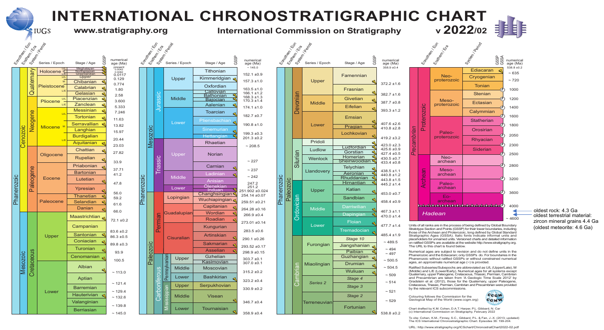
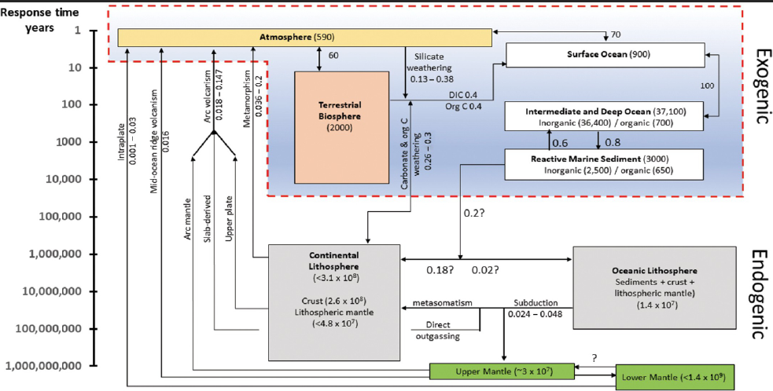
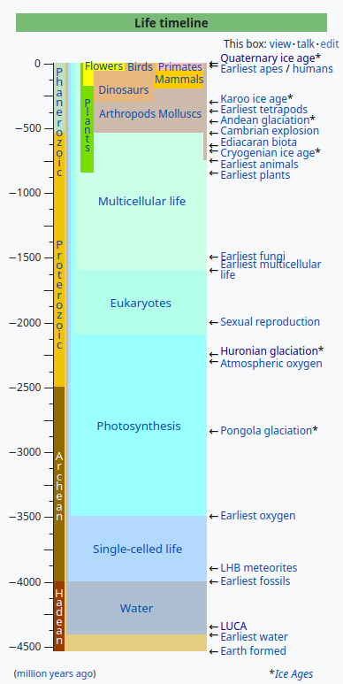
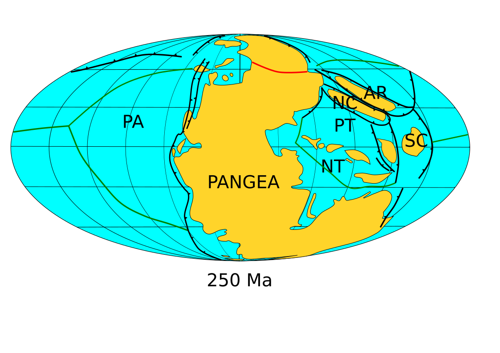
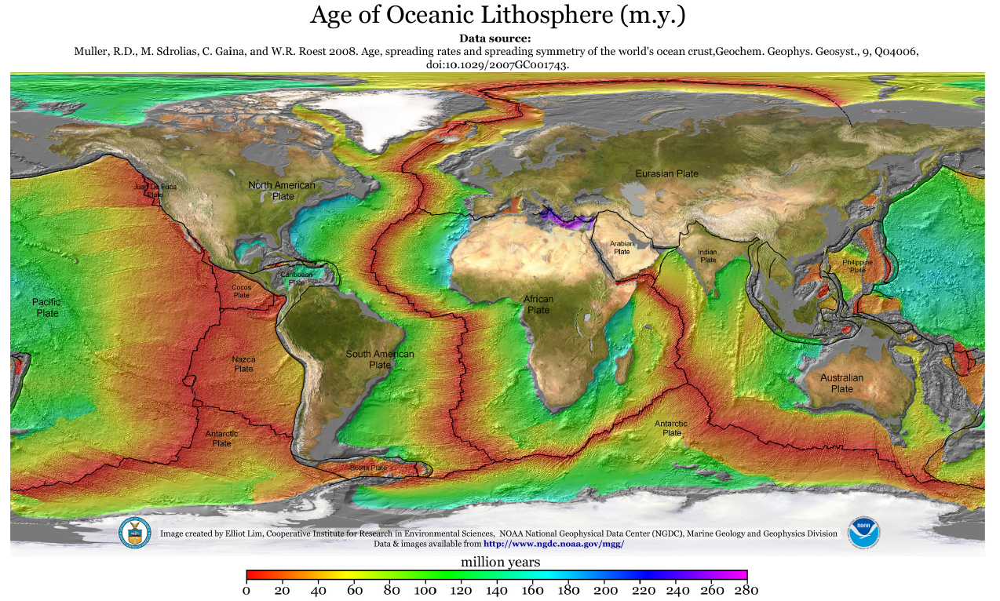
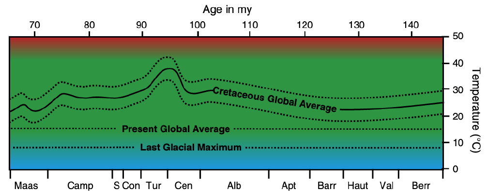
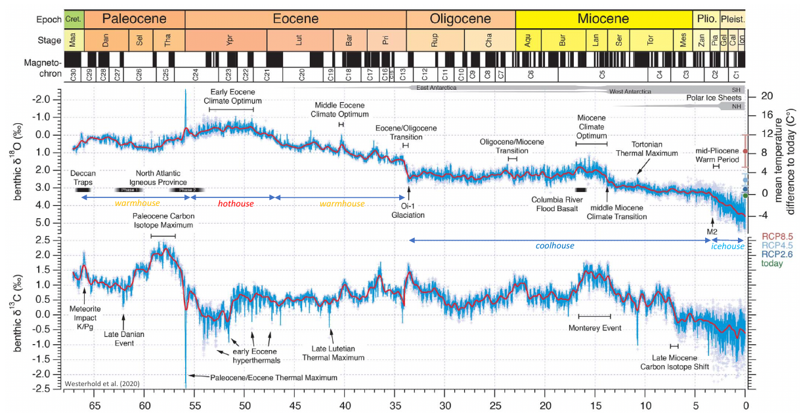

# Climate change in the geological past
# Module 2: Pre-quaternary climate change

Earth system is in a perennial non-equilibrium state.

## Stratigraphy

Rocks are the archive of Earth's past history, and therefore climate.

Stratigraphic records may contain gaps (hiatuses).

Source: [stratigraphy.org](https://stratigraphy.org/ICSchart/ChronostratChart2022-02.pdf)

## Tectonic time-scale climate change

Climate forcing:

1. Tectonic processes $\rightarrow$ impact on oceanic currents
2. Earth's orbit changes
3. Strength of Sun changes $\rightarrow$ increases over time (so far)

## Carbon cycle

### Exogenic

Surface or near-surface processes.

Near steady-state equilibrium.

Carbon reservoirs, their sizes and rates of exchange:

1. **Vegetation**: 610 Gt, full exchange in few years (2:1 sink:source to atmosphere and only source to soils)
2. **Atmosphere**: 600 Gt, full exchange in few years (1:1 sink:source to ocean top layers, mostly sink to soils) 
3. **Soils**: 1560 G, full exchange in few years (small source to ocean top layers)
4. **Ocean top (mixed) layers**: 1000 Gt, full exchange in few years
5. **Deep ocean**: 38 kGt, full exchange with top layers in some centuries, partly isolated by the thermocline (1:1 sink:source to top layers, small source to rocks)
6. **Rocks**: 66 MGt, full exchange in 100 ka or Ma (small source to atmosphere)

99% of Earth's available carbon is stored in rocks.

### Endogenic

Earth's interior (mantle and below) processes. We don't really know how much carbon is stored in the mantle.

Drive out of equilibrium the endogenic steady-state periods:

1. Greenhouse
2. Icehouse

Sources to exogenic:

1. **Volcanoes** and **hot springs** $\rightarrow$ without their contribution all the $CO_{2}$ would be removed in just 4 ka
2. **Metamorphism** $\rightarrow$ **decarbonation**

Sinks from exogenic:

1. **Weathering**

## Biosphere and climate

### Photosynthesis

Oceanic **photic** zone: 100 m.

Bioprocesses mainly done by **phytoplanton** sequester $CO_{2}$ and other nutrients into ocean deeper layers. Nutrients are upwelled and $CO_{2}$ is accumulated in sediments.

Yearly cycles in $CO_{2}$ concentration are due to vegetation season cycles in the northern emisphere where most of land plants are located $\rightarrow$ but no land plat until Devonian.

Mass extinctions and new taxa creation had effects on climate.

### Organic carbon subcycle

Photosynthesis extracts carbon from the atmosphere $\rightarrow$ rapid cycle via oxydation/burning or slower cycle via burial $\rightarrow$ erosion or further burial in rocks $\rightarrow$ release via volcanism

### Life controls climate

1. Removing carbon $\rightarrow$ life as Earth's thermostat
2. Climate change $\leftrightarrow$ biological evolution

## Proxies

### Biotic proxies

1. **Pollen** $\rightarrow$ great for distinguish between interglacial and glacial periods
2. **Plankton** (shells) $\rightarrow$ great sequestrors of carbon

### Geological and geochemical proxies

Carbon mineral evolution: the number of carbon-bearing species increased vastly during the Earth's geological history.

## Weathering

Fluvial transport $\rightarrow$ 19000 Mt/year, mostly from south-east Asia river systems (Brahmaputra, Ganges, Indus, Chang Jiang, Mekong) and other big rivers (Colorado, Amazon, Mississipi, Orinoco, Danube)

1. Mechanical
2. Chemical (dominant in St. Lawrence, Lena, Yenisei, Dienpr, Ob)

Most sedimentation happens near-shore in particular near river mouths (only fine sediments like clay can go farther). Deep ocean sedimentation rates are close to zero.

### Physical weathering

#### Terrigenous sediments

1. Source area $\rightarrow$ engines of erosion:
	* weathering
	* tectonic perturbations
2. Transport area $\rightarrow$ engines:
	* water
	* wind
	* ice
3. Sink or deposition area $\rightarrow$ sedimentary basin

Ice-rafted debris: dropstones trasported by ice and then dropped by icebergs typical of glacial periods.

### Chemical weathering

Ions are removed from rocks and transported away.

1. **Dissolution** $\rightarrow$ carbonate and evaporite $\rightarrow$ no sequestration of $CO_{2}$
2. **Hydrolysis** $\rightarrow$ water is chemically added to rocks $\rightarrow$ sequestration of $CO_{2}$
    * $H_2 CO_2 = H_2 O + CO_2$
	* **Laterite** (red residual soils, bauxite and other ores) $\rightarrow$ proxy for tropical paleoclimate

Chemical weathering provides a negative feedback to adding/removing $CO_{2}$ from the atmosphere.

### Faint young Sun paradox

Young Sun was fainter $\rightarrow$ Earth's water should have been frozen up to 1.5 Ga, but it had not been always the case:

1. Cooler temperature $\rightarrow$ less weathering $\rightarrow$ more $CO_{2}$ in the atmosphere
2. Less continental area $\nearrow$

Great oxygenation event: 2.4 Ga

## Carbon capture

1. Very expensive to remove $CO_2$ directly from the atmosphere
2. Research focuses in capturing $CO_2$ where it's produced $\rightarrow$ stocking $CO_2$ and $CH_4$ in empty oil reservoirs $\rightarrow$ optimizes extraction

## Precambrian (4.6 Ga - 500 Ma)

### Cryogenian (720 Ma)

#### Snow ball Earth

1. Hypothesis by Paul Hoffman
2. Cryogenian glaciations:
    1. **Sturtian**
    2. **Marinoan**

### Plate tectonics

Margins:

1. Divergent
2. Convergent
3. Transform

### Paleomagnetism

1. Reversal of magnetic lineations on ocean floors
2. Changes in magnetization on rocks

### Earth's structure

| Compositional layers | Composition        | Mechanical layers | Rheology                      |
|----------------------|--------------------|-------------------|-------------------------------|
| Core                 | Metallic           | Inner core        | Solid                         |
| Core                 | Metallic           | Outer core        | Liquid                        |
| Mantle               | Silicates          | Mesosphere        |                               |
| Mantle               | Silicates          | Asthenosphere     | Deformable, mechanically weak |
| Oceanic crust        | Basalts            | Litosphere        | Rigid, elastic                |
| Continental crust    | Granites (thicker) | Litosphere        | Rigid, elastic                |

### Tillites vs evaporites

1. **Tillites**: derived from lithification of sediments under glacial conditions
2. **Evaporties**: derived from evaporation os sea water under arid conditions

## Phanerozoic and Paleozoic (539 - 252 Ma)

From the Phanerozoic the glaciations stopped reaching lower latitudes in contrast to 

### Plants

First evidence of plant in the **Silurian** (443 Ma)

### Carboniferous (358 - 299 Ma)

1. Onset of Atlantic glaciation $\leftarrow$ lowering $CO_2$
2. Most of hydrocarbon deposits originated in late Carbonifeous and ealry **Permian** (299 - 252 Ma) $\leftarrow$ oxygen increase due to organic material deposition $\leftarrow$ climate instability (rising/lowering sea level, coastal plant die-off)

#### Pangaea climate

1. 250 - 180 Ma
2. No ice sheet $\rightarrow$ warmer climate (some areas where at polar latitutes) $\leftarrow$ higher $CO_2$ &#126; 1600 ppm (due to compensation effect to fainter Sun)
3. Arid at low latitudes
4. High continentality
5. Strong monsoon winter/summer reversal $\rightarrow$ strong seasonal humidity contrast $\leftarrow$ Pangaean red soils

## Tectonic control of $CO_2$

### BLAG (Berner, Lasaga and Garrels) hypothesis

1. Control of $CO_2$ level by **seafloor spreading** and subduction
2. Faster spreading rate in the past, confirmed by magnetic stripes on ocean floor (paleomagnetic dating) $\rightarrow$ rapid $CO_2$ input $\rightarrow$ increased temperature, rain, vegetation
3. Slower spreading rate $\rightarrow$ decresed temperature, rain, vegetation
4. Long, slow rock-atmosphere carbon cycle $\rightarrow$ relative climate stability
5. Weathering as negative feedback

#### Testing

Difficult to test (ocean crust is young)

1. 100 Ma: spreading rate was faster and $CO_2$ level higher (OK)
2. Now: spreading rate is slow and $CO_2$ level smaller (OK)

### Uplift weathering hypothesis

1. Weathering as driver of climate change, not only negative feedback
2. Physical weathering creates larger attack surface for chemical weathering $\rightarrow$ younger rocks weather fast leaving behind only weather-resistant older rocks
3. Orogeny $\rightarrow$ more uplift $\rightarrow$ more weathering

#### Evidence

**Wind River valley** (Wyoming) moraines exponentially decaying weathering rate $\leftarrow$ rate of weathering estimated by total loss of weathering-sensitive cations

#### Testing

Hypothesis is supported for the following periods:

| Period                                                   | Climate   | Orogeny          |
|----------------------------------------------------------|-----------|------------------|
| 325 - 240 Ma: Paleozoic up to Triassic (early Mesozoic)  | Icehouse  | Hercynian        |
| 240 - 35 Ma: Mesozoic up to Eocene                       | Greenhouse| No               |
| 35 Ma - now: Eocene up to Holocene                       | Icehouse  | Alpine-Himalayan |

An unusually large amount of high topography exists at the present $\rightarrow$ unusually strong weathering rate

## Cretaceous (145 - 66 Ma) greenhouse

1. Peak: 94 Ma $\rightarrow$ Cenomanian-Turonian boundary (CTB)
2. High sea level: > 80-100 m than present level
3. Tropical seaway from Pacific to Atlantic to Indian oceans via Mediterranean
4. Climate Leaf Analysis Multivariate Program (CLAMP)
5. Palms at high latitudes and dinosaurs in northern Asia
6. Presence of large deposits of coal and lignite
7. Global mean temparature: up to 20-30 $^{\circ}C$
8. Pangaea broken up
9. Lot of shallow epicontinental seas

### Cretaceous oceanic anoxic events (OAEs)

Increased volcanism $\rightarrow$ $CO_2$ release and greenhouse effect $\rigtharrow$ more weathering and nutrient influx in water, sea level rise and more phytoplankton $\rightarrow$ more organic productivity $\rightarrow$ oxygen depletion $\rightarrow$ more carbon burial: **black shale** and **gas hydrates** formation

### Eustatic (global) seal level change

Reasons for higher seal level in mid-Cretaceous and approximate contribution

1. High stand
    1. No ice sheets &#126; 65 m
    2. Thermal expansion &#126; 7 m
2. Fast spreading rate of ocean ridges $\rightarrow$ bigger volume of oceanic crust rocks &#126; 10-100 m
3. Less continental collisions $\rightarrow$ smaller "roots" in mantle &#126; 10 m
4. Less deep sea fan (delta) sedimentation &#126; 10 m

### Cretacean-Paleogene boundary (KPB)

Reference layer: **El Kes/Elles** in Tunisia $\rightarrow$ red layer

#### Impact theory

1. Luis and Walter Alvarez found evidence
2. End of Mesozoic: **Cretacean-Paleogene boundary** (KPB)
    1. Iridium anomaly
    2. Major extinction events
    3. Lamellae in crystal lattices (quartz) $\leftarrow$ mechanical shock
    4. Yucatan impact Chicxulub crater candidate (discovered later)

##### Impact of ...impacts on climate

1. Minutes: warming
2. Days - years: cooling $\leftarrow$ acid rains
3. Decades - centuries: warming $\leftarrow$ higher $CO_2$
4. Geological timescales: little impact

#### Deccan traps

1. Large volcanic province in western India: basaltic lava flooding up to 2 km thick &#126; 67-62 Ma $\rightarrow$ volcanic **mantle plume** $\rightarrow$ Reunion hotspot: chain of volcanic centers getting younger as travelling south
2. Foraminifera evolutionary trends (paleogeological aspect):
    1. Larger and more specialized species go extinct
    2. Small and cosmopolitan species survive
    3. Adaptive small new species thrive

## Cenozoic (66 Ma - now)

### Proxies

1. $\delta ^{18}O$: proportion of stable isotopes of oxygen $^{16}O$ and $^{18}O$ $\rightarrow$ $\Delta \delta ^{18}O_{ocean} \propto - \Delta T$ 
    1. $^{16}O$ preferentially evaporates
    2. $^{18}O$ preferentially precipitates (rain)
2. $\delta ^{13}C$: proportion of stable isotopes of carbon $^{12}C$ and $^{13}C$ $\rightarrow$ $\Delta \delta ^{13}C_{ocean} \propto \Delta T$
    1. Plant $CO_2$ enriched in $^{12}C$
    2. Volcanic $CO_2$ enriched in $^{13}C$
3. $Mg$/$Ca$ ratio in benthic foraminifera deposits: more $Mg$ substitutes $Ca$ in rocks if warmer temperatures

### Cooling events

1. Eocene-Oligocene transition (EOT): dramatic cooling event $\leftarrow$ beech disappears from Antarctica, Grande Coupure in Europe and Asia $\leftarrow$ closure of Turgay strait

### Hyperthermals

Rapid onset warming events associated with deep-ocean acidification, carbonate dissolution and foraminifera species extinction $\leftarrow$ huge release of greenhous gasses

1. Paleocene-Eocen thermal maximum (PETM) $\leftarrow$ due to volcanism and uplift associated with the North Atlantic Igneous province

### Middle Eocene climate optimum (MECO) (40 Ma)

### Miocene climate optimum (around 14-17 Ma)

1. 3-4 $^{\circ}C$ warmer than present
    1. Warmer and wetter Antarctica
2. Due to generation of Columbia River igneous province

#### Monterey hypothesis

Positive $\delta ^{13}C$ excursion $\leftarrow$ massive organic carbon burial

### Gateway hypothesis

Opening or closing of ocean gateways $\rightarrow$ onset of both southern and northern glaciation during the last 50 My?

1. Drake passage opening $\rightarrow$ doesn't seem to have altered Antarctica glaciation
2. Panama hysthmus formation $\rightarrow$ enhanced Gulf stream and therefore moved heat to north Atlantic and removed heat from American landmass $\leftarrow$ in contradiction with climate models
3. The Gomphotherium landbridge formation $\rightarrow$ Terminal Tethyan Event (TTE) $\rightarrow$ had effect on biota but not on climate
