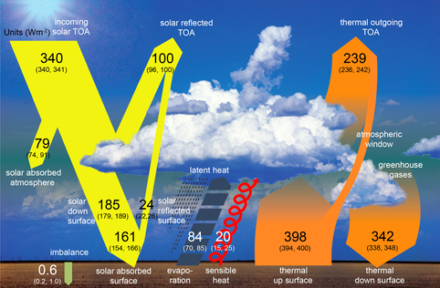
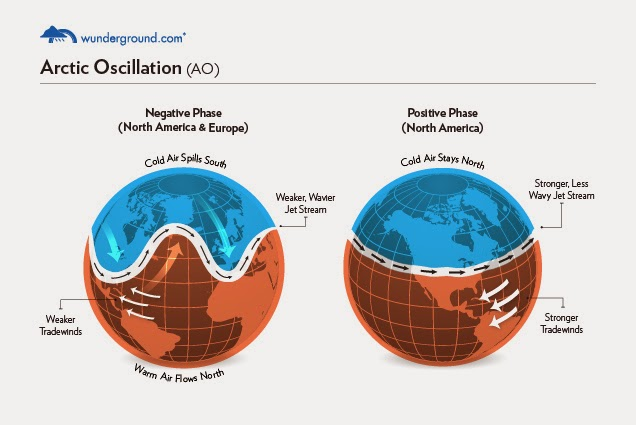

# Climate System Modelling

Notes for classes of course part of M.Sc. in Science of Climate at UniBo.

## Brief timeline of climate modelling

1. 4th century BCE: first book on meteorology, De Meteorologica by **Aristotle**
    1. Argumentative approach vs factual
    2. Mentions climate change
2. 1904: Vilhelm **Bjerkenes**, two rules to create a climate model:
    1. knowing the initial state
    2. knowing the laws that connect two subsequent states
3. 1922: Lewis Fry **Richardson** first attempted to do a climate model (still useful blueprint). Reasons for failure:
    1. equations were too complex (not all wave solutions are equally important for climate)
    2. calculations were almost impossible to do by hand
4. 1930s: Carl Gustav **Rossby** found the required approximations
5. late 1940s, early 1950s: Jule **Charney** group at Princeton with Von Neumann computer at IAS
6. 1956: **Philips** introduced simple forcing and carried out time integration independent of initial state
7. 1950s and 1960s: first computer centers for numerical climate simulations (GFDL $\rightarrow$ NOAA and others)

## Climate vs weather

Components:
1. Atmosphere
2. Hydrosphere (oceans, rivers, underground water, water cycle)
3. Cryosphere
4. Biosphere (terrestrial and marine ecosystems)
5. Ground, mountains
6. Sun $\rightarrow$ only source of energy

## General circulation

Modern view (Tor **Bergeron**) $\rightarrow$ 3 cells:
1. **Hadley**, direct $\rightarrow$ high precipitation InterTropical Convergence Zone (**ICTZ**)
2. **Farrel**, indirect $\rightarrow$ rectified effect, a statistical remnant
3. Polar (direct, weaker)

[Wikipedia](https://en.wikipedia.org/wiki/Trade_winds)

### Winds

#### Zonal winds

East-west or west-east wind component.  
Zonal winds exhibit a strong seasonal cycle.  

1. Trade winds (easterlies) $\rightarrow$ negative $u < 0$
2. Westerlies $\rightarrow$ positive $u > 0$, due to Coriolis force
3. Jet stream, tropospheric westerly with max $u >$ Earth's speed of rotation, circumpolar vortex is contained by jet stream

#### Meridional winds

North-south or south-north wind component.  
Meridional winds are due to 3-cell circulation, they can reverse the direction with the season.  

#### Surface winds

Surface winds create torque over oceans.

### Temperature

Lapse rate:
1. Polar vs. mid-latitude vs. tropics
2. Summer vs. winter
3. Near surface inversion in polar winter

 (An Introduction to Three-Dimensional Climate Modeling, Washington and Parkinson, 2005)

Average surface temperature:
1. Continentality $\rightarrow$ mostly northern empisphere
2. Ocean currents can mitigate temperatures at higher latitudes

### Humidity

Most atmospheric water is along the equatorial area and in the lower levels.

### Geopotential

The geopotential (height) is the height at which a specific level of pressure can be found (e.g. 500 or 800 or 1000 hPa).  
Wind blows keeping high geopotential to the right.  

**Eddy field**: $\phi = \overline\phi + \phi'$

### Mean sea level pressure

Integrates all features due to the other quantities.

### Sea surface temperature (SST)

Higher at the equator and east-west gradient.

## Energy

### Energy budget

$F_{RAD} - F_{SH} - F_{LH} - F_{G} - F_{H} = 0$

1. $F_{RAD}$: net radiation flux
2. $F_{SH}$: sensible heat flux $\rightarrow$ from Earth to atmosphere
3. $F_{LH}$: latent heat flux $\rightarrow$ due to change of phases
4. $F_{G}$: heat flux from the subsurface layers
5. $F_{H}$: heat flux due to phase change of water

([MET](www.met.reading.ac.uk/~sgs02rpa/CONTED/cl-intro.html))

## Natural variability

**Teleconnections**: anomalies or "covariation of remote regional climates either contemporaneously or at nonzero lag/lead times" (Vasubandhu Misra, in Regionalizing Global Climate Variations, 2020 via [ScienceDirect](https://www.sciencedirect.com/topics/earth-and-planetary-sciences/teleconnection)).  

Technique to separate the preferred modes of variation:
1. Empirical Orthogonal Functions (**EOF**), aka Principal Component Analysis (PCA): "a field is partitioned into mathematically orthogonal (independent) modes which sometime may be interpreted as atmospheric and oceanographic modes ("structures")" ([NCAR](https://climatedataguide.ucar.edu/climate-tools/empirical-orthogonal-function-eof-analysis-and-rotated-eof-analysis) by Dennis Shea)

### El Ni&#241;o and Southern Oscillation (ENSO)

**Walker circulation**:  ([gktoday](https://www.gktoday.in/upsc-questions/what-are-walker-circulations-and-how-does-it-influ/))

1. **El Ni&#241;o**: warming in tropical Pacific near South America coastline $\rightarrow$ no cold water upwelling $\rightarrow$ warmer SST
2. Normal condition: strong trades on tropical Pacific $\rightarrow$ cold water upwelling
3. **La Ni&#241;a**: cooling in tropical Pacific $\rightarrow$ more cold water upwelling

### Arctic Oscillation

1. Warm phase: lower pressure on Arctic, higher pressure on North Atlantic, stronger trades in the subtropics $\rightarrow$ warmer winters in midlatitudes and droughts on Mediterranean
2. Cold phase: higher pressure on Arctic, lower pressure on North Atlantic, weaker trades in the subtropics $\rightarrow$ colder winters in midilatitued and stormy Mediterranean

 ([wunderground.com](https://weatherwilly.blogspot.com/2014/10/arctic-oscillation-set-to-tank.html))

### North Atlantic Oscillation (NAO)

Relative change in strength of Azores high and Icelandic (or subpolar) low. ([MET-UK](https://www.metoffice.gov.uk/weather/learn-about/weather/atmosphere/north-atlantic-oscillation))

1. Negative NAO: weaker Azores-Iceland difference $\rightarrow$ more rain in Southern Europe
2. Positive NAO: stronger Azores-Iceland difference $\rightarrow$ more rain in Norther Europe

 ([polarpedia.eu](https://polarpedia.eu/en/north-atlantic-oscillation-nao/))

### Monsoon

Seasonal phenomenon related to:
1. ICTZ summer/winter variations due to ocean larger thermal capacity than land resulting in land heating up faster than ocean in summer
2. ENSO
    1. El Ni&#241;o $\rightarrow$ dry monsoon
    2. La Ni&#241;a $\rightarrow$ wet monsoon

 ([CLIVAR](https://www.clivar.org/clivar-panels/monsoons))

([ux1.eiu.edu](https://www.ux1.eiu.edu/~cfjps/1400/circulation.html))

## Fundamental equations

### Frame of references

**Control volume**
1. **Eulerian** frame: control volume $\delta x \delta y \delta z$ of fixed position with respect ot coordinate system
    1. **Advective (material) derivative**: ${d \over dt} = {\partial \over \partial t} + \mathbf{v} \cdot \nabla$ 
2. **Lagrangian** frame: control volume is an infinitesimal mass of fluid moving with its motion

### Forces

A number of forces act on a volume element on the rotating Earth's surface:

1. Friction
2. Gravity
3. Pressure gradient
4. Inertial forces:
    1. Coriolis force
    2. Centripetal force

### Spherical coordinates

Expressed in spherical coordinates:

([ITC](https://kartoweb.itc.nl/geometrics/Coordinate%20systems/coordsys.html))

1. $\lambda$: longitude
2. $\phi$: latitude
3. $r = a + z$: radial distance, $a =$ Earth's radius
    1. ${\partial \over \partial r} = {\partial \over \partial z}$
    2. $a \approx r$

#### Gradient

$$\nabla_{z,\phi,\lambda} = \left( {\partial \over \partial z}, {1 \over a} {\partial \over \partial \phi}, {1 \over a \cos \phi} {\partial \over \partial \lambda} \right)$$

#### Velocity

1. **zonal**: $u = r \cos \phi {d \lambda \over dt}$
2. **medidional**: $v = r {d \phi \over dt}$
3. $w = {dr \over dt}$

#### Advective derivative

$${d \over dt} = {\partial \over \partial t} + {u \over a \cos \phi} {\partial \over \partial \lambda} + {v \over a} {\partial \over \partial \phi} + w {\partial \over \partial z}$$

Equations are coupled and non-linear.

### Conservation laws

1. Momentum: $\mathbf{F} = {d(m \mathbf{v}) \over dt}$
2. Mass: $M = \int_{V} \rho dV$
3. Energy $\rightarrow$ first law of thermodynamics: $C_V {dT \over dt} = -p {d \over dt} \left( {1 \over \rho} \right)$

### Equation of state

4. $p = \rho RT$

### General approximations

1. Shallow water: $z << a$
2. Scaling $\rightarrow$ remove terms smaller than:
    1. meridional scale: ~100-1000 km
    2. velocity scale: ~10 m/s

### Balances

Further approximations not always applicable

3. **Geostrophic** (horizontal): perfect balance between Coriolis and pressure gradient forces $\rightarrow$ not OK at Equator ($f=0$, good at mid-latitudes
    1. **Rossby number**: $R_0 ={u \over f_0 L}$ $\rightarrow$ if $R_0 << 1$ then geostrophic approximation is valid
    2. Wind rotation:
        1. Northern emisphere: counter-clockwise around lows
        2. Sourthern emisphere: clockwise around lows
4. **Hydrostatic** (vertical): perfect balance between gravity and pressure gradient forces ${\partial p \over \partial z} = -g \rho$
    1. Adiabatic **lapse rate**: ${dT \over dz} = -{g \over C_p}$

### Primitive equations

### Other definitions and concepts

1. **Coriolis parameter**: $f$ $\rightarrow$ surviving Coriolis term after general approximations
2. **Potential temperature**: $\theta = T \left( {p_0 \over p} \right)^{R \over C_p}$
3. Adiabatic processes: $Q = 0$ $\rightarrow$ $Q$ is the **non-adiabatic term** $\rightarrow$ crucial in models
4. **Scale height**: $H = {RT_0 \over g}$

### Simplification

To solve analytically:

1. No rotation
2. No sphericity
3. Beta-plane: $f = f_0 + \beta y$
4. No meridional coordinates

### Waves

Solutions found with perturbations.

1. Lamb waves
2. Gravity waves
3. Acoustic waves (removed with hydrostatic approximation)

### Dynamics

#### Homogenous flow

$$H(x,y) = H_0 - h(x,y) + \eta (x,y,t)$$

Poincar&#233; modes  

##### Approximations

1. No rotation
2. Rigid lid approximation
3. Beta-plane

##### Velocity equations

1. ${\partial u \over \partial t} = -u {\partial u \over \partial x} - v {\partial u \over \partial y} + fv$
2. ${\partial u \over \partial t} = -u {\partial v \over \partial x} - v {\partial v \over \partial y} - fu$
3. ${\partial u \over \partial x} + {\partial v \over \partial y} = 0$

##### Vorticity and divergence equations

1. (Vertical component of) **vorticity**: $\zeta = {\partial v \over \partial x} - {\partial u \over \partial y}$ $\leftarrow$ 3D vorticity $= \nabla \times \mathbf{v}$
    1. **Barotropic equation**: ${\partial \zeta \over \partial t} = -u {\partial \zeta \over \partial x} -v {\partial \zeta \over \partial y} -\beta v$
    2. **Potential vorticity**: ${d \over dt} \left( \zeta + f \right) = 0$ $\leftarrow$ $f =$ planetary vorticity
2. (Horizontal) **divergence**: $D = {\partial u \over \partial x} + {\partial v \over \partial y}$ $\leftarrow$ total divergence: $D = \nabla \cdot \mathbf{v}$
3. **Stream function**: $\psi$ $\leftarrow$ Helmoltz theorem: $\mathbf{v} = \mathbf{k} \times \nabla \psi + \nabla \chi$
    1. $u = -{\partial \psi \over \partial y}$
    2. $v = {\partial \psi \over \partial x}$
    3. $\zeta = \nabla^2 \psi$ $\rightarrow$ Laplacian: divergence of gradient, elliptic function, eigenfunctions are spherical harmonics  

Barotropic equation in terms of streamfunction valid for **quasi-geostrophic** conditions:
$${\partial \over \partial t} \left( \nabla^2 \psi \right) + J \left( \psi, \nabla^2 \psi + f_0 +\beta y \right) = 0$$

$J$: Jacobian operator

#### Rossby waves

Solutions found by linearizing the barotropic equation around the basic state $U$: $\omega = Uk - {k \beta \over (k^2 + l^2)}$ $\leftarrow$ $k$, $l$ wavenumbers

## Processes

### Radiation

A layered atmosphere is considered.

#### Solar radiation spectra
1. Black body $\rightarrow$ **Lambert's law**:
    1. Absorption: $dI = -Ik \rho dz$ $\rightarrow$ $\tau = {I \over I_0} = e^{-\chi}$
        1. Optical depth: $\chi = \int k \rho dz$
        2. Fractional trasmission coefficient: $\tau$
    2. Emission (Kirkhoff's law): $dI = B(T)k \rho dz$ $\rightarrow$ Stefan-Boltzmann law: $\pi B(T) = \epsilon \sigma T^4$ ($\epsilon$: emissivity)
2. Schwartzchild's equation (fluxes): ${1 \over \rho} {dI \over dz} = -k (I-B(T))$
3. Heating rate: ${\partial T \over \partial t} = - {1 \over \rho C_p} {\partial \over \partial z} \left( F^{\uparrow} - F^{\downarrow} \right)$

### Moisture

Moisture is conserved.

1. Mixing ratio: $q = {\rho_w \over \rho}$
2. Specific humidity: ${\rho_w \over \rho + \rho_w}$
3. Relative humidity: ${r = {q \over q_s}}$ where $q_s =$ saturated mixing ratio

#### Equation of moisture

$${\partial ( \rho q) \over \partial t} + \nabla \cdot (\rho q \vec{\nu}) + {\partial \over \partial z} (\rho qw) = M + \rho E$$

#### Moist thermodynamics

Considering adiabatic processes only: $q \approx 0.622 {e \over p}$ where water vapor partial pressure $e = \rho_w R_w T$

#### Moist adiabatic lapse rate

$${dT \over dz} = -{g \over c_P} - {L \over c_P} {dq_s \over dz}$$

#### Precipitation

Rain occurs when air is supersaturated with vapor: $q > q_s$

#### Clouds

### Surface processes

#### Richardson number

1. $R_i > {1 \over 4}$: stable, laminar
2. $R_i > 0$: stable, turbulent
3. $R_i < 0$: unstable

#### Monin-Obukhov length

Ratio between mechanical and buoyancy production (power?).

### Ocean dynamics

1. **Salinity**: new state variable
2. Air-sea interections by exchange of:
    1. momentum
    2. heat

### Sea ice

### Rivers

## Numerical methods

### Finite differences

#### Schemes

1. Two-level
    1. Euler (forward)
    2. Backward
    3. Trapezoidal
    4. Matsuno
2. Three-level
    1. Leapfrog
    2. Adams-Bashfort
    3. General

#### Stability

Von Neumann stability parameter for wave solutions.

$$\lambda = {1 + i \alpha p \over 1 - i \beta p}$$

#### Advection equation

##### Linear

$${\partial u_j \over \partial t} = -c {\partial u \over \partial x}$$

Discretization:
1. Leapfrog scheme $\rightarrow$ Courant-Friedrichs-Lewy criterion
2. Matsuno scheme $\rightarrow$ a dissipative scheme is added

##### Non-linear

$${\partial u_j \over \partial t} = -u {\partial u \over \partial x}$$

**Aliasing**: $k_{max} = {\pi \over \Delta x}$, waves with $k_u > k_{max}$ will be misrepresented as longer waves $\rightarrow$ **non-linear instability**: creation of higher wavenumbers

#### Conservation

The aliasing problem show the necessity of having numerical models that reflect required conservation laws (e.g. mass, energy).

##### Total energy

Is conserved for homogeneous flow with no topography.

##### Arakawa Jacobian

A numerical Jacobian that conserves:

1. Energy
2. Enstrophy: $\zeta^2$

$$J_A = {1 \over 3} \left(J^{++} + J^{\times + } + J^{+ \times} \right)$$

#### Gravity waves

1. ${\partial u \over \partial t} = -g {\partial H \over \partial x}$
2. ${\partial H \over \partial t} = -H_0 {\partial u \over \partial x}$

#### Grids

1. 1D
    1. Staggered grid
2. 2D
    1. Arakawa grids

##### Dispertion properties

### Spectral methods

Interesting properties:

1. Derivarive $\rightarrow$ multiplication
2. Exact derivative (with truncation limit)
3. No aliasing
4. Minimum resolvable scale = smallest wavelength in truncation

#### Fourier series

##### Interaction coefficients $c_{jkn}$

$${du_k \over dt} = - \sum_{j,n} iku_j(t)u_k(t)c_{kjn}$$

#### Gibbs phenomenon

Ringing around sharp transitions.

#### On the sphere

1. ${\partial \mathbf{V} \over \partial t} + (\mathbf{V} \cdot \nabla) \mathbf{V} = -f \mathbf{k} \times \mathbf{V} - \nabla \Phi$
2. ${\partial \Phi \over \partial t}  + (\mathbf{V} \cdot \nabla) \Phi = - \Phi \nabla \cdot \mathbf{V}$

##### Sperical harmonics

##### Truncation

##### Gaussian grids

##### Fast Fourier Transform (FFT)

##### Lagrangian methods

To fix Gibbs phenomena.

##### Semi-lagrangian methods

## Radiative forcing

**OLR**: Observed Longwave outgoing Radiative flux $\sigma T^4 = OLR_{mean}$

### Two-layer atmosphere

### Three-layer atmosphere

### Convection

Radiative convection equilibrium
